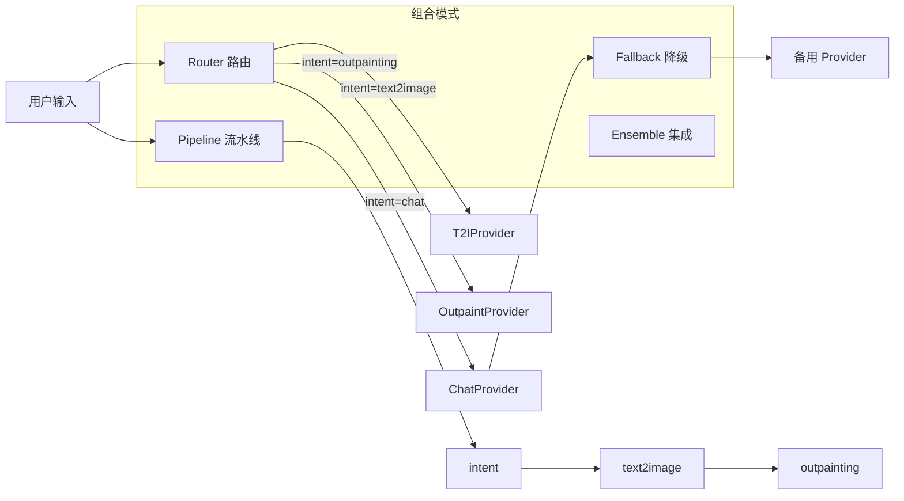
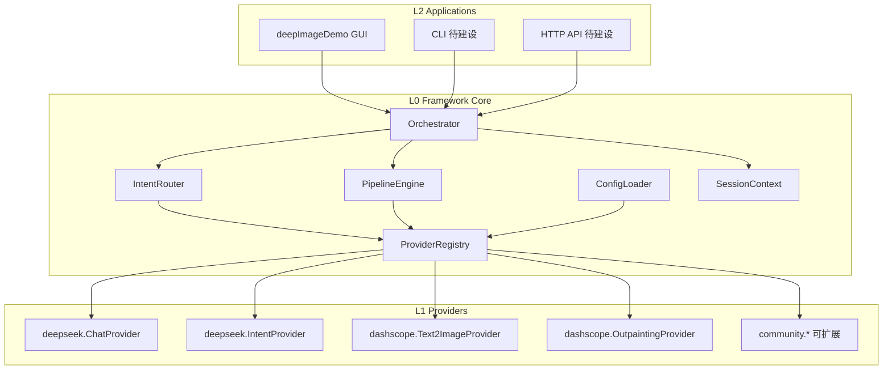

# deepDemoV2 / MultiModel Framework 项目规范

> **版本：** v0.2-spec  
> **状态：** 规范定稿中 · 代码处于 Demo → Framework 迁移期  
> **许可证：** Unlicense（见 `LICENSE`）

---

## 1. 项目定位

### 1.1 愿景

deepDemoV2 将从单一桌面 Demo **演进为开源多模型组合框架（MultiModel Framework，简称 MMF）**：

- **组合（Compose）**：将对话、意图识别、文生图、扩图、上传等不同能力的多模型服务编排为统一工作流
- **可插拔（Pluggable）**：新增模型提供商或替换底层模型，不改动业务编排代码
- **开源（Open Source）**：提供清晰抽象、配置约定与贡献指南，供社区扩展 Provider 与 Demo 应用

### 1.2 分层定位

| 层级 | 名称 | 职责 | 当前状态 |
|------|------|------|---------|
| L0 | **Framework Core** | 能力抽象、注册表、路由、流水线、配置 | 规划中 |
| L1 | **Providers** | 各厂商/模型的具体实现（DeepSeek、DashScope…） | 部分实现（扁平模块） |
| L2 | **Applications** | GUI、CLI、Web、API Server 等终端应用 | `deepImageDemo.py`（参考实现） |
| L3 | **Examples** | 最小可运行示例、集成教程 | 待建设 |

**原则：** Framework Core 不依赖 tkinter；`deepImageDemo.py` 仅是 L2 的一个官方 Demo，不是框架本体。

### 1.3 目标用户

| 用户类型 | 使用方式 |
|---------|---------|
| 应用开发者 | 引用框架编排多模型能力，构建自有产品 |
| Provider 贡献者 | 实现并注册新的模型适配器 |
| 终端用户 | 运行官方 Demo 或社区应用 |
| 研究者 / 教学 | 通过 Examples 理解多模型组合模式 |

`[可修改]` 正式发布名称、PyPI 包名（如 `multimodel-framework`）待定。

---

## 2. 核心设计理念

### 2.1 设计原则

1. **Provider 无关**：业务层只依赖 Capability 接口，不直接 import 厂商 SDK
2. **配置驱动**：模型选择、API Key、默认参数通过 `config/models.yaml` 声明，支持环境变量覆盖
3. **单一职责**：Router 负责意图分发，Pipeline 负责多步编排，Provider 只负责单次模型调用
4. **向后兼容**：迁移期保留现有扁平模块，通过 Adapter 逐步接入 Core
5. **可观测**：每次模型调用记录 provider、model、latency、status，便于调试与开源协作
6. **安全默认**：密钥不入库、不硬编码、日志脱敏

### 2.2 能力模型（Capability Taxonomy）

框架将 AI 能力划分为标准 **Capability**，每个 Capability 可挂载多个 **Provider**：

| Capability ID | 说明 | 当前实现 | 计划 Provider |
|---------------|------|---------|---------------|
| `chat` | 多轮对话、流式输出 | DeepSeek | DeepSeek, OpenAI, Ollama, `[可扩展]` |
| `intent` | 用户意图分类 | DeepSeek | DeepSeek, 本地小模型, 规则引擎 |
| `text2image` | 文生图 | DashScope 万相 | DashScope, Stability, DALL·E, `[可扩展]` |
| `outpainting` | 图像外绘/扩图 | DashScope imageedit | DashScope, `[可扩展]` |
| `image2image` | 图生图/编辑 | — | DashScope, `[可扩展]` |
| `upload` | 媒体上传至模型侧 | OSS 上传器（未接入） | DashScope OSS, S3, `[可扩展]` |
| `embedding` | 文本/图像向量 | — | `[可扩展]` |
| `speech` | 语音合成/识别 | — | `[可扩展]` |

新增 Capability 须：更新本表、定义 Protocol、在 Registry 注册、补充 Example。

### 2.3 组合模式（Composition Patterns）

框架支持以下多模型组合方式：



| 模式 | 场景 | 示例 |
|------|------|------|
| **Router** | 根据意图选择单一 Provider | 用户说「画一只猫」→ `text2image` |
| **Pipeline** | 多步串联，上一步输出作为下一步输入 | 生成图 → 自动扩图 → 返回最终结果 |
| **Fallback** | 主 Provider 失败时切换备用 | DeepSeek 超时 → 切换 OpenAI |
| **Ensemble** | 多 Provider 并行，择优或合并 | 多模型同时生图，用户选择 `[可修改]` |

---

## 3. 框架架构

### 3.1 目标架构图



### 3.2 核心抽象（Framework Core API）

以下为框架层必须实现的接口约定（Python `Protocol` 或抽象基类）：

#### 3.2.1 `BaseProvider`

```python
class BaseProvider(Protocol):
    capability: str          # 如 "chat", "text2image"
    provider_id: str         # 如 "deepseek", "dashscope"
    model: str               # 如 "deepseek-chat", "wanx2.1-t2i-turbo"

    def health_check(self) -> bool: ...
    def invoke(self, request: ProviderRequest) -> ProviderResponse: ...
```

#### 3.2.2 `ProviderRequest` / `ProviderResponse`

统一请求/响应信封，避免各模块返回 `list`、`dict` 不一致：

```python
@dataclass
class ProviderRequest:
    capability: str
    prompt: str
    context: dict[str, Any] = field(default_factory=dict)   # 会话、图片路径等
    params: dict[str, Any] = field(default_factory=dict)  # temperature, size...

@dataclass
class ProviderResponse:
    success: bool
    capability: str
    provider_id: str
    model: str
    text: str | None = None
    files: list[str] = field(default_factory=list)        # 本地文件路径
    metadata: dict[str, Any] = field(default_factory=dict)
    error: str | None = None
```

#### 3.2.3 `IntentRouter`

```python
class IntentRouter(Protocol):
    def route(self, prompt: str, context: SessionContext) -> RouteResult: ...

@dataclass
class RouteResult:
    intent: str              # 对应 Capability 或业务意图名
    confidence: float = 1.0
    params: dict[str, Any] = field(default_factory=dict)
```

#### 3.2.4 `PipelineEngine`

```python
class PipelineEngine(Protocol):
    def run(self, pipeline_id: str, initial_request: ProviderRequest) -> ProviderResponse: ...
```

Pipeline 在配置中声明步骤序列，例如 `generate_then_outpaint`。

#### 3.2.5 `SessionContext`

跨 Capability 共享状态：

```python
@dataclass
class SessionContext:
    conversation_history: list[dict]
    last_artifact: str | None = None    # 最近生成的图片/文件路径
    metadata: dict[str, Any] = field(default_factory=dict)
```

### 3.3 Provider 注册机制

```python
# 框架内部
registry.register("chat", "deepseek", DeepSeekChatProvider)
registry.register("text2image", "dashscope", DashScopeText2ImageProvider)

# 社区扩展（插件入口）
# pyproject.toml: [project.entry-points."mmf.providers"]
# my_pkg.providers:register = "my_pkg.providers:register_all"
```

注册规则：

- `provider_id` 全局唯一（建议 `{vendor}.{capability}`）
- 同一 Capability 可注册多个 Provider，由配置指定默认项
- 注册时声明 `required_secrets`（如 `DEEPSEEK_API_KEY`）

---

## 4. 目标目录结构

### 4.1 框架期目录（Target Layout）

```
deepDemoV2/
├── mmf/                              # Framework Core（L0）
│   ├── __init__.py
│   ├── types.py                      # Request/Response/Context 数据类
│   ├── registry.py                   # ProviderRegistry
│   ├── router.py                     # IntentRouter 实现
│   ├── pipeline.py                   # PipelineEngine
│   ├── orchestrator.py               # 统一编排入口
│   ├── config.py                     # ConfigLoader
│   └── exceptions.py
│
├── providers/                        # 官方 Provider（L1）
│   ├── deepseek/
│   │   ├── chat.py
│   │   └── intent.py
│   ├── dashscope/
│   │   ├── text2image.py
│   │   ├── outpainting.py
│   │   └── upload.py
│   └── __init__.py                   # 默认 register_all()
│
├── apps/                             # 终端应用（L2）
│   └── desktop/
│       └── deep_image_demo.py        # 自 deepImageDemo.py 迁移
│
├── examples/                         # 示例（L3）
│   ├── 01_single_chat.py
│   ├── 02_text2image.py
│   ├── 03_router_demo.py
│   └── 04_pipeline_generate_outpaint.py
│
├── config/
│   ├── models.yaml                   # 模型与 Provider 配置
│   ├── pipelines.yaml                # 流水线定义
│   └── models.example.yaml
│
├── utils/
│   └── base64_image_processor.py
│
├── tests/
│   ├── test_registry.py
│   ├── test_router.py
│   └── providers/
│
├── docs/                             # 开源文档
│   ├── architecture.md
│   ├── provider-guide.md
│   └── configuration.md
│
├── deepImageDemo.py                  # 迁移期保留，标记 deprecated
├── PROJECT_SPEC.md
├── CONTRIBUTING.md                   # 待补充
├── CHANGELOG.md                      # 待补充
├── requirements.txt
├── pyproject.toml                    # 待补充，支持 pip install -e .
└── README.md
```

### 4.2 当前目录（Legacy Layout）

迁移完成前，以下文件视为 **Legacy Adapter 源**：

| 遗留文件 | 目标 Provider |
|---------|---------------|
| `intent_classifier.py` | `providers/deepseek/intent.py` |
| `imageSynthesis.py` | `providers/dashscope/text2image.py` |
| `aliyunImageExtender.py` | `providers/dashscope/outpainting.py` |
| `aliyunFileUploader.py` | `providers/dashscope/upload.py` |
| `deepImageDemo.py` | `apps/desktop/deep_image_demo.py` |

**命名迁移约定：**

- 新代码：`snake_case` 模块名（PEP 8）
- 旧代码：迁移期保留，文件头加 `# LEGACY: see providers/...`

---

## 5. 配置规范

### 5.1 统一配置源

废弃 `.apikey` + `.env` 双轨，统一为：

| 优先级 | 来源 |
|--------|------|
| 1 | 环境变量 |
| 2 | `config/models.yaml` |
| 3 | 代码默认值 |

`.apikey` 在 v1.0 移除；迁移期 GUI「设置」写入 `config/models.yaml` 或 `.env`。

### 5.2 `config/models.yaml` 示例

```yaml
# config/models.example.yaml — 复制为 models.yaml 后填写

secrets:
  deepseek_api_key: ${DEEPSEEK_API_KEY}
  dashscope_api_key: ${DASHSCOPE_API_KEY}

defaults:
  router:
    provider: deepseek
    model: deepseek-chat
  chat:
    provider: deepseek
    model: deepseek-chat
    params:
      max_tokens: 1024
      temperature: 0.7
      system_prompt: "你是一个助手"
  intent:
    provider: deepseek
    model: deepseek-chat
  text2image:
    provider: dashscope
    model: wanx2.1-t2i-turbo
    params:
      size: "1024*1024"
  outpainting:
    provider: dashscope
    model: wanx2.1-imageedit
    params:
      top_scale: 1.2
      bottom_scale: 1.2
      left_scale: 1.2
      right_scale: 1.2

# 多 Provider 并存时可指定降级链
fallbacks:
  chat: [deepseek, openai]    # [可修改]

storage:
  output_dir: generated_images
  log_file: logs/conversation.log
```

### 5.3 `config/pipelines.yaml` 示例

```yaml
pipelines:
  generate_then_outpaint:
    description: 文生图后自动扩图
    steps:
      - capability: text2image
        input: prompt
      - capability: outpainting
        input: last_artifact
        params:
          direction: all

  chat_with_tools:              # [可修改] 预留
    steps: []
```

### 5.4 密钥与环境变量

| 变量名 | 用途 |
|--------|------|
| `DEEPSEEK_API_KEY` | DeepSeek 对话 / 意图 |
| `DASHSCOPE_API_KEY` | 阿里云万相 / 扩图 / 上传 |
| `OPENAI_API_KEY` | `[可扩展]` OpenAI Provider |
| `MMF_CONFIG_PATH` | 自定义配置文件路径 |

---

## 6. 编排与业务规则

### 6.1 标准请求流程（Target）

```
用户输入
  → Orchestrator.handle(user_input, session)
    → IntentRouter.route() → intent
    → 若命中 Pipeline 配置 → PipelineEngine.run()
    → 否则 → Registry.get(capability, provider).invoke()
  → 更新 SessionContext（conversation_history, last_artifact）
  → 返回 ProviderResponse → Application 层渲染
```

### 6.2 意图 → Capability 映射

| Intent | Capability | 默认 Provider |
|--------|------------|---------------|
| `IMAGE_GENERATION` | `text2image` | dashscope |
| `OUTPAINTING` | `outpainting` | dashscope |
| `OTHER` | `chat` | deepseek |

`[可修改]` Intent 枚举迁移为框架级 `mmf.types.Intent`，与 Provider 解耦。

### 6.3 跨模型状态传递

| 状态字段 | 生产者 | 消费者 |
|---------|--------|--------|
| `conversation_history` | `chat` | `chat`, `intent` |
| `last_artifact` | `text2image`, `outpainting` | `outpainting`, `image2image` |
| `upload_url` | `upload` | 需要 URL 而非 Base64 的 Provider |

### 6.4 异步与并发

- 所有 Provider `invoke()` 在框架层视为 **可阻塞**；Application 负责线程/async 调度
- Pipeline 步骤默认串行；`[可修改]` 支持 parallel 步骤
- 任务超时、重试策略在 `models.yaml` 的 `params` 中配置

---

## 7. Provider 开发规范

### 7.1 新增 Provider 检查清单

- [ ] 实现 `BaseProvider`，声明 `capability` / `provider_id`
- [ ] 在 `providers/{vendor}/` 下创建模块，不修改 Core
- [ ] 在 `providers/__init__.py` 或 entry-point 中注册
- [ ] 补充 `config/models.example.yaml` 配置项
- [ ] 编写 `examples/` 最小示例
- [ ] 编写 `tests/providers/test_{vendor}_{capability}.py`
- [ ] 更新本文档 Capability 表
- [ ] 文档说明 required secrets、支持参数、已知限制

### 7.2 Provider 实现模板

```python
# providers/example_vendor/text2image.py
from mmf.types import ProviderRequest, ProviderResponse

class ExampleText2ImageProvider:
    capability = "text2image"
    provider_id = "example"
    model = "example-model-v1"

    def __init__(self, api_key: str, **defaults):
        self.api_key = api_key
        self.defaults = defaults

    def health_check(self) -> bool:
        return bool(self.api_key)

    def invoke(self, request: ProviderRequest) -> ProviderResponse:
        # 1. 合并 request.params 与 self.defaults
        # 2. 调用厂商 API
        # 3. 统一返回 ProviderResponse（含 files 本地路径）
        ...
```

### 7.3 错误处理约定

| 错误类型 | 框架异常 | HTTP 映射 `[API 期]` |
|---------|---------|---------------------|
| 密钥缺失 | `MissingSecretError` | 401 |
| Provider 不可用 | `ProviderNotFoundError` | 404 |
| 厂商 API 失败 | `ProviderInvokeError` | 502 |
| 超时 | `ProviderTimeoutError` | 504 |

Provider 不得吞掉异常；须设置 `ProviderResponse.success=False` 或向上抛出框架异常。

---

## 8. 应用层规范（L2）

### 8.1 官方 Demo：`deepImageDemo`

定位：**Framework 的参考实现**，展示 Router + 多 Provider 组合。

应用层职责：

- UI 渲染、用户交互
- 调用 `Orchestrator`，不直接调用厂商 SDK
- 密钥配置界面 → 写入统一配置

`[可修改]` 后续可增加：

- `apps/cli/` — 命令行交互
- `apps/api/` — FastAPI REST / SSE 流式接口

### 8.2 Application 接入示例（Target API）

```python
from mmf import Orchestrator
from mmf.config import load_config

config = load_config()
orchestrator = Orchestrator.from_config(config)

response = orchestrator.handle(
    user_input="画一张日落海滩",
    session=session,
)
# response.files → 展示图片
# response.text  → 展示文本
```

---

## 9. 开源框架规范

### 9.1 版本策略（SemVer）

| 版本段 | 含义 |
|--------|------|
| MAJOR | 破坏性 API 变更（Core Protocol、配置格式） |
| MINOR | 新 Provider、新 Capability、新 Pipeline |
| PATCH | Bug 修复、文档、无破坏性参数扩展 |

当前：**0.x** — 公共 API 可能变动，以 `PROJECT_SPEC.md` 与 `CHANGELOG.md` 为准。

### 9.2 分支与发布

| 分支 | 用途 |
|------|------|
| `main` | 稳定可发布代码 |
| `develop` | 集成开发 `[可修改]` |
| `feature/*` | 功能分支 |
| `provider/*` | 社区 Provider 贡献 |

发布检查清单：

- [ ] `CHANGELOG.md` 已更新
- [ ] `examples/` 可运行
- [ ] 核心测试通过
- [ ] `models.example.yaml` 与文档同步

### 9.3 贡献者分级

| 角色 | 权限范围 |
|------|---------|
| **User** | 使用框架、提 Issue |
| **Contributor** | 提交 Provider、Example、文档 PR |
| **Maintainer** | 审核 Core API 变更、发版 |
| **Core Team** | 架构决策、Capability 标准制定 |

### 9.4 代码规范

- 语言：Python `>= 3.10` `[可修改]`
- 风格：PEP 8；新代码使用类型注解
- 文档：公开 API 须有 docstring；用户文档放 `docs/`
- 测试：Core 与 Provider 须有单元测试；Mock 外部 API
- 依赖：核心依赖与 Provider 可选依赖分离（`requirements-core.txt` / `requirements-providers.txt`）`[可修改]`

### 9.5 安全与合规

- 禁止提交真实 API Key
- 日志中对 Key 脱敏（仅显示末 4 位）
- 第三方 Provider 须在 README 注明数据出境与服务条款
- 用户上传媒体默认存本地 `output_dir`，不未经同意上传第三方

### 9.6 文档体系（待建设）

| 文档 | 受众 |
|------|------|
| `README.md` | 快速上手 |
| `PROJECT_SPEC.md` | 架构与规范（本文件） |
| `docs/provider-guide.md` | Provider 开发者 |
| `docs/configuration.md` | 运维与配置 |
| `CONTRIBUTING.md` | 贡献流程 |
| `CHANGELOG.md` | 版本变更 |

---

## 10. 技术栈

| 层级 | 技术 | 说明 |
|------|------|------|
| 语言 | Python >= 3.10 | |
| Core | dataclasses, typing, Protocol | 无重型框架依赖 |
| 配置 | PyYAML + python-dotenv | |
| 对话 | openai SDK（兼容 DeepSeek） | 通过 Provider 封装 |
| 图像 | dashscope, Pillow, requests | |
| 应用 | tkinter（Demo） | 可替换 |
| 打包 | PyInstaller | Demo 分发 |
| 测试 | pytest | 待引入 |
| CI | GitHub Actions | 待引入 |

---

## 11. 迁移路线图

### Phase 0 — 规范与基线（当前）

- [x] `PROJECT_SPEC.md` 框架化定稿
- [x] `requirements.txt`、`.gitignore`
- [ ] `CONTRIBUTING.md`、`CHANGELOG.md`
- [ ] `config/models.example.yaml`
- [ ] `pyproject.toml`（`pip install -e .`）

### Phase 1 — 抽出 Framework Core

- [ ] 创建 `mmf/types.py`（统一 Request/Response）
- [ ] 创建 `mmf/registry.py`
- [ ] 创建 `mmf/orchestrator.py`
- [ ] 修复扩图返回值与 `last_artifact` 契约
- [ ] Legacy 模块加 Adapter，行为与现网一致

### Phase 2 — Provider 插件化

- [ ] 迁移 `providers/deepseek/`、`providers/dashscope/`
- [ ] 实现 `config/models.yaml` 加载
- [ ] `deepImageDemo` 改为只调用 Orchestrator
- [ ] 添加 `examples/01~04`

### Phase 3 — 多模型组合增强

- [ ] PipelineEngine（`generate_then_outpaint`）
- [ ] Fallback 链
- [ ] 上传本地图 → `upload` → `outpainting` 链路
- [ ] Provider 健康检查与诊断命令

### Phase 4 — 开源生态

- [ ] `docs/provider-guide.md`
- [ ] GitHub Actions CI
- [ ] 社区 Provider 模板仓库 `[可修改]`
- [ ] CLI / HTTP API 应用
- [ ] PyPI 发布

### Phase 5 — 稳定版 1.0

- [ ] API 冻结公告
- [ ] 移除 Legacy 扁平模块
- [ ] 完整测试覆盖与性能基准

---

## 12. 已知问题与技术债

| 问题 | 影响 | 迁移归属 |
|------|------|---------|
| 配置双轨（`.apikey` / `.env`） | 部署混乱 | `mmf/config.py` |
| 无统一 Response 类型 | 扩图返回值 bug | `mmf/types.py` |
| GUI 与 SDK 耦合 | 难以扩展应用形态 | `apps/desktop/` |
| `llm` 未使用 | 冗余依赖 | 清理或纳入 Provider |
| 无意向 Pipeline | 无法组合多模型 | `mmf/pipeline.py` |
| 无 tests / CI | 开源协作风险 | `tests/` + Actions |

---

## 13. 快速决策表

| 想做什么 | 规范位置 | 实现位置（Target） |
|---------|---------|-------------------|
| 新增模型厂商 | §7 Provider 规范 | `providers/{vendor}/` |
| 新增能力类型 | §2.2 Capability 表 | `mmf/types.py` + Registry |
| 多步模型编排 | §5.3 pipelines.yaml | `mmf/pipeline.py` |
| 修改默认模型 | `config/models.yaml` | — |
| 新增终端应用 | §8 应用层规范 | `apps/{name}/` |
| 贡献代码 | §9 开源规范 | `CONTRIBUTING.md` |
| 发布版本 | §9.1 SemVer | `CHANGELOG.md` |

---

## 14. 附录：当前实现 vs 目标对照

| 能力 | 当前文件 | 目标 Provider | 组合方式 |
|------|---------|---------------|---------|
| 对话 | `deepImageDemo.send_query_to_openai` | `deepseek.ChatProvider` | Router → chat |
| 意图 | `intent_classifier.py` | `deepseek.IntentProvider` | Router 入口 |
| 文生图 | `imageSynthesis.py` | `dashscope.Text2ImageProvider` | Router / Pipeline |
| 扩图 | `aliyunImageExtender.py` | `dashscope.OutpaintingProvider` | Router / Pipeline |
| 上传 | `aliyunFileUploader.py` | `dashscope.UploadProvider` | Pipeline 前置步骤 |

---

## 15. 版本记录

```markdown
## [Unreleased]
### Added
- MultiModel Framework 规范：Capability、Provider、Pipeline、开源协作约定
- 目标目录结构与 config/models.yaml 配置草案

### Changed
- 项目定位从单一 Demo 升级为开源多模型组合框架

## [0.1.0] - 历史基线
- DeepSeek 对话 + 万相文生图 + 扩图 Tkinter Demo
```

---

*本文档随框架演进持续更新。Core API 变更须同步修改 CHANGELOG 并标注破坏性变更。*
